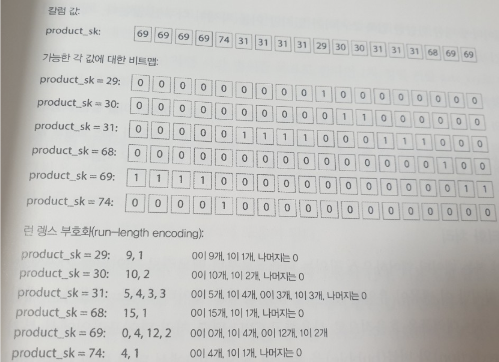
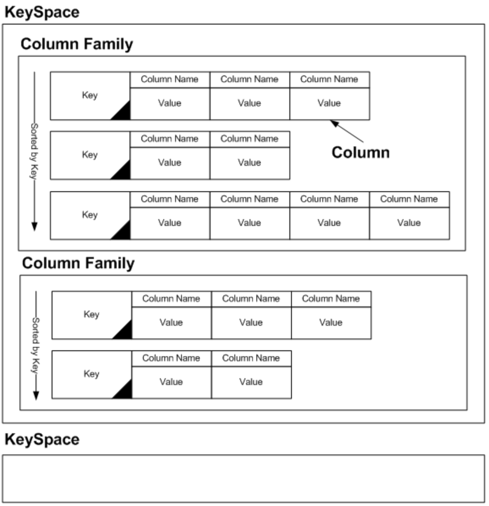

# 컬럼 지향 저장소

분석을 할 때는 aggregation을 주로 하기 때문에 **select** 구문을 쓸 일이 거의 없고 aggregation을 하는 일부 칼럼에만 접근을 한다. (OLTP DB는 로우지향 방식으로 데이터를 배치한다.)

칼럼지향 저장소라는 것은 모든 값을 하나의 로우에 함께 저장하지 않는 대신 **각 칼럼별로 모든 값을 함께 저장한다**는 의미이다. 

- product_id: 89, 33, 11, 33 ....
product_name: aa,bb,cc,dd ...
(세번째 데이터의 정보를 가져오기 위해서는 각 칼럼의 세번째 정보를 가져온 뒤 모아야 한다.)

필요한 칼럼 별로 저장하는 방법 말고, 데이터를 압축하는 방법도 있다.

### 칼럼 압축

- 같은 속성값에 대한 값들을 쭉~저장하기때문에 같은 값들이 반복해서 나타날 수 있다. 이걸 압축 할 수 있다.
- 비트맵 부호화(bitmap encoding)

    

    WHERE product_sk IN (30, 68, 69): 30, 68, 69에 대한 비트맵을 OR를 계산한다.

    WHERE product_sk = 31 AND store_sk=3: 각 비트맵의 AND를 계산한다. (product_sk와 store_sk는 다른 칼럼이지만 '칼럼의 순서가 같다 == 같은 row의 데이터다' 이니까 노상관이다!) 

- n(네모칸 갯수)이 작고 값의 종류가 많다 = 위와 같이 저장하면된다.
n이 크고 값의 종류가 적다 = 0이 더 많다(sparse하다) → **런렝스부호화(run-length encoding)**

카산드라, HBase의 칼럼패밀리는 칼럼지향적 아니다. 칼럼패밀리 안에는 로우 키에 따라 로우와 모든 칼럼을 함께 저장하기때문에 칼럼 압축을 사용하지 않는다. (로우지향적)

- Cassandra column family

    [https://bcho.tistory.com/440](https://bcho.tistory.com/440)

    

### 칼럼 저장소의 순서 정렬

- 칼럼을 독립적으로 정렬을 해선 안된다. (A칼럼의 k번째 값이 B칼럼의 k번째 값과 같은 row인걸 보장해야하니까)
- `1차 정렬 키`: 정렬의 기준이 되는 키. (query가 last month처럼 시간 범위로 한다면 date_key로 선택한다.)
`보조 정렬 키`: 1차 정렬키로 정렬을 한 다음 그 안에서도 같은 값이 존재할 경우 보조 정렬키를 사용해 다시 정렬.
- 이렇게 정렬을 해두면 위에서 얘기한 run-length encoding시 개이득
- 이건 조회할때가 아니라 저장하는 시점을 뜻하는거야. 정렬을 해서 저장하겠다.

**같은 데이터를 다양한 방식으로 정렬하는건 어떨까?** 

- 여러번 복제를 하는고.
- C-Store에서 소개했고 상업용 데이터 웨어하우스인 버티카에 채택됨.
- 장애에도 대응할수있다.
- 로우 지향 저장에서 여러 2차 색인을 갖는 것과 유사함.
→ 한곳에 모든 row를 유지하면서  / 2차 색인은 일치하는 row를 가리키는 포인터만 포함한다.
- 칼럼저장에서는 데이터를 가리키는 포인터는 없고, 값을 포함한 칼럼만 존재함.

### **쓰기는 어떻게 할까?**

- B 트리처럼 제자리 갱신(update-in-place)는 압축된 칼럼에서는 불가능해.
- solution: LSM 트리
    - 인메모리 저장소로 이동해 정렬된 구조에 추가하고 디스크에 쓸 준비를 한다.
    - 충분한 쓰기를 모으면 디스크의 칼럼 파일에 병합하고 대량으로 새로운 파일에 기록한다.

### 집계(aggregation): 구체화 뷰(materialized view), 데이터 큐브(Data cuve)

데이터 웨어하우스에서 칼럼지향으로 저장하는건 필수는 아냐. 로우지향보다 빠르니까 점점 인기가 많아지고 있을뿐.. 

이렇게 집계를 더 빠르게 할수있는 방법으로 구체화뷰, 데이터 큐브라는 개념이 있어. "미리 계산(캐싱)해서 쓰자"

**구체화뷰**

- 구체화 집계(materialized aggregate): count, sum, avg, min, max를 캐싱해서 쓰자!
- 이런 캐시를 만드는 방법이 구체화 뷰(materialized view).
- RDB의 virtual view와 비슷한데, virtual view는 query의 단축키 같은 느낌이라면, 구체화 뷰는 복사본이기때문에 데이터가 변경되면 같이 갱신해줘야해.

**데이터 큐브(=OLAP 큐브)**

- n차원으로 구체화 뷰를 만든거.
- product X date를 row, column으로 2차원 테이블을 만들면 product별 합계, date 별 합계, product와 date 총 합계를 얻을수있다.
- 속성값이 5개면 5차원 하이퍼큐브가 만들어지며 동작원리는 2차원과 같아.
- 단점: 데이터에 query하는 것만큼 유연성이 없다. 예를 들어, price를 n차원으로 표현할 때 사용하지 않았다면 where price > 100인 합계를 구할 수 없다. 그래서 그냥 특정 질의에 대해 성능을 향상 시킬때만 써.

데이터웨어하우스 라고 하는 애들은 내부적으로 칼럼지향적으로 설계해놓았겠지? 
쿼리는 OLAP 처럼 쓴대
e.g. redshift, couchDB